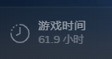

# 骑马与砍杀 霸主

*果然通往艾尔登法环的路都是艰辛的，自从上次写完鬼谷八荒之后，又把老头换摸了起来，打到天空之城就又打不动了，正巧看到有主播在玩骑砍，就转战到骑砍调整下心情。于是入手了骑砍1战团，骑砍1战团玩了大概有5个多小时就打不动了，这个画面实在太复古了。于是又入手了霸主2，迄今为止已经连续打了61.9个小时了，又到了瓶颈期😂，我玩游戏还真是喜新厌旧。*

## 首次接触

这不是我第一次接触骑砍系列，在上初中的时候就听说过骑砍的大名了，当时也下载过盗版的骑砍（小县城与那个年代的情况确实导致我那时候没有支持正版的概念），不过对于一个十几岁的娃来讲，骑砍过于复杂，并且不够华丽。相比于其他同时期网游，这个复古的中世纪游戏很难支撑我长久的玩下去，在我的印象里他就是一个在大地图上带队跑来跑去，然后进入战斗后砍来砍去的游戏，相比于传统网游缺少感官的刺激。

所以我觉得实际来讲，这次游玩就是我第一次玩骑砍系列，它确实足够优秀，以至于让我沉迷两周，一共玩了61.9小时。这对于一个上班族来说就是最大的夸奖。

对于这个很有深度的游戏，我这点游戏时间，我自己根本没有什么信心能对游戏做什么评价，甚至我自己描述自己的感受都不一定准确。所以这篇文章更倾向于我来阐述一下我的游玩过程，来给未来可能有的“总结篇”打下一点基石。

## 初出茅庐

我玩的是1.71版本，还不是release版本而是一个beta版，所以游戏的兵种强度，玩法收益在更新中有较大的调整，这导致我在游玩之前或者说游玩中都很难找到一些准确的攻略，大部分的攻略都只能参考，然后自己摸索、印证。比如1.7之前战队可以在“队伍”界面编辑，从而使英雄单独一队，避免他们死亡。但是在1.7版本以后，编辑战队只存在于开战前了。

另外由于我看的攻略比较激进，导致我上来就选择了最高难度，还好我对自己有所认知，对自己的伤害选择了1/2，不然我这游戏怕是有的玩了。但实际上，这种选择并没有给我带来什么困扰，反而增加了游戏乐趣（除了看到比我多1/3的人就要跑路以外）。这种游戏难度的提升真正的提升了游戏的体验，让我做选择时更加慎重，这种乐趣一直持续到我开始SL之后。

在游戏的开局，我是认真的在扮演一位中世纪的小子，在这片大陆上厮混，从来没有考虑过变成封臣这件事情，就仅仅作为一个坐拥几十号兵马的雇佣兵，一直为南帝国服务。

## 封臣阶段

就一直当雇佣兵打了有20小时？也许更久。事情的变化源于某天我碰到南帝国进攻库赛特的某座城堡，恰巧库塞特守城成功，但是只余下10余人存活，我一上头带着我的几十号兵就上阵了（这些兵我是从开始带到结尾，这个阶段我还十分稀罕我这些兵马，甚至很臭屁的分出来了20个步兵，20个射手，20多个骑兵和20多个可汗这样子）。这场战斗彻底改写了大陆的历史，由于我本人的指挥失败，导致我损兵折将了一半有余才拿下来这座小小的城堡。可令人失望的是，南帝国的女王转头把城堡分封给了其他人，于是我怒火中烧，令投西帝国当雇佣兵去了。

在投靠西帝国后，我在网上搜索才知道必须成为封臣才能获得封地，于是我千辛万苦的找到西帝国的boss，向他效忠成为封臣，然后就去讨老婆了，这个时候我已经27岁了。谁知道刚讨到老婆，西帝国的boss就战死沙场了，于是乎我这个新晋封臣，大陆菜鸟就成了西帝国的boss，肩负起了帝国复兴的重任。

## 四处讨伐

对于我这种新晋boss，可想而知带着几十个人马只能任贵族揉捏。几乎没有的影响力，让我的家族在西帝国中风雨飘摇。但是当时我甚是一个有责任心的boss，无论战役大小，我都亲临战场，亲自指挥。慢慢的我的家族就从3级变到4级，同时由于贵族们给力，拿下了沙漠的一块城堡，喜滋滋的也拥有了自己的第一块城堡。

于是我开始学习怎么做好一位领主，同时也通过各种攻略学会了如何做一名合格的国王，如何制定策略，与贵族斗智斗勇，耗光他们的影响力，这着实有一种中世纪互相制衡的意思。随着游戏的继续，我的家族变成了5级，同时开展多种策略之下，我自己的部队上限已经到了300余人。这让我十分膨胀，也确实如此。同时由于1.71版本的打铁依旧强势，而且有SL大法的加持，这让我的游戏乐趣大幅降低。这使得最近的游戏过程十分枯燥，因为此时我的目标是政府整片大陆，我开始慢慢的坐镇指挥，不像开始那样心疼自己的战损，随着拿下一块又一块地盘，游戏也变得重复起来。

## 反思

到了今天，我已经两三天没有打开骑砍2了，就是因为SL的存在，让我的游戏过程愈加随心所欲，需要思考和斟酌的东西越来越少，同时由于打铁，也让我少了很多贸易玩法的体验。我有感觉骑砍2应该相当用心的做了贸易系统，但是由于打铁的存在导致了贸易变得有些鸡肋。这是游戏本身多样性的体现，把选择权交给玩家，但是我不是一个有耐心的玩家，我选择了这些bug一样的体验，现在我受到了反噬，这让我的游戏过程愈加的枯燥，变成了点点点，而不是一个真正生活在大陆上呼风唤雨的西帝国国王。我觉得如果有一天我要捡起来它重新来过的话，我应该会选择不能随时存档，并且尽量的减少打铁的次数吧。虽然我现在心中仍有执念，想要在这个存档中完成一统帝国的霸业，但是真的，好累。

## 战斗系统

随着年龄的加大，我越来越觉得相生相克的“猜拳”战斗模式是这类格斗游戏中最好的体验，像是永劫无间的振刀，骑砍的格挡等等，他要求你短时间内“识别”或是“猜测”对面的动作，并且在极短的时间内做出正确的反应。这是带给我最大的战斗乐趣，他不华丽，也没有复杂的技能build（当然build有另外的魔力，但我觉得不适用于与人或与AI的博弈类游戏），反而是朴素的几个招式，却带来了最大的博弈快感，或许这就是猜拳的乐趣。
