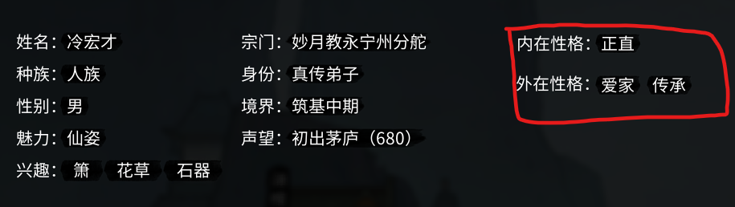
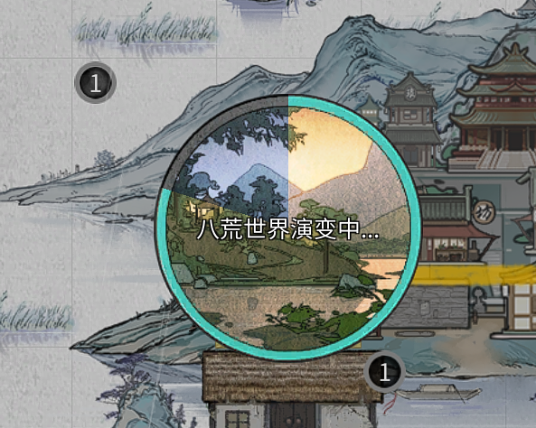
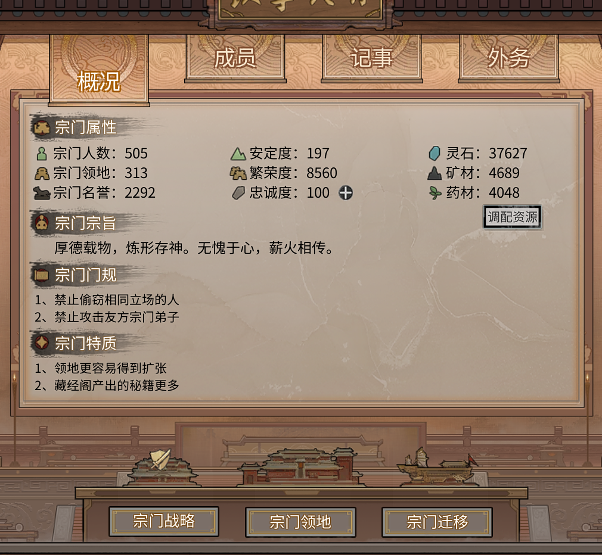
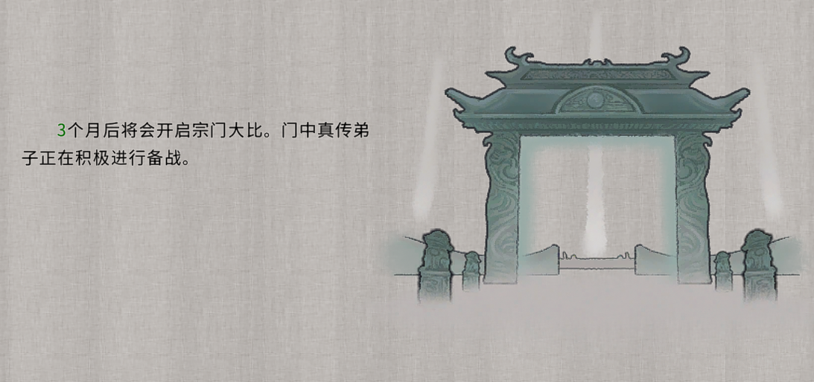
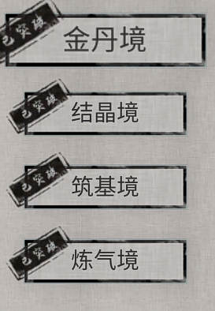

# 鬼谷八荒，个人游戏体验

*最近在玩老头环、双人成行、永劫无间等等的同时，为了减少这些紧张刺激的游戏带来的疲劳，又捡起来了一款以前只玩过十几个小时的国产修仙游戏，鬼谷八荒。希望能记录下来对于这个游戏的想法，让自己能理解到这个游戏哪里吸引到了我。*

## 1.Nan

上次接触这个游戏的时候，还是它刚刚面世，当时听说它玩起来很有修仙的感觉，本着支持国产+独立小精品的想法入手了。可惜的是直到目前为止，一共也只玩了二十多个小时，成就也就只开了一小半，就遇到了跟上次弃坑一样的原因，**过度重复**。可以想象我还会在不远的将来弃掉它😂。

可能现在聊这款游戏，言之尚早，毕竟我是一个只玩了不到30个小时的萌新，很有可能后面还有更加有意思、更独特的内容等待着去体验，所以我的随想大多数都是针对于我个人，30h游戏时长的感受，而不是对游戏的评价。

## 2.亮点

这个游戏最最吸引人的点就在于**随机**，它的随机跟普通游戏理解的随机有很大的不同，普通游戏的随机往往是装备爆率随机，打造词条随机等等，虽然鬼谷八荒有着一样的随机性，但最吸引人的还是NPC随机。

这里说的NPC随机不仅仅是随即出来的庞大的NPC群体，更大的是NPC的随机属性（性格？）这种特点使得我在游玩过程中拥有了很多的惊喜，让人有种 “我不是在玩单机游戏” 的错觉。

出于程序员的天性使然，我有时候会对这个游戏的实现进行一些揣测，我感觉每个月的跳转时候，会遍历所有的NPC群体，根据他们的性格去做相应的操作。举个例子，在每个月跳转的时候，所有的NPC开始密集活动，这个时候会发生论道，盗窃，寻仇等等。当然，并不是全部的NPC活动都聚集在了月份跳转的时候，只是我感觉这个时候最密集。

这种与NPC的交互，特别是根据他们性格随机生成的交互，让我有了一种网游的错觉。可能是我第一次接触这种实现游戏的原因，我觉得还是挺新鲜的，应该这不是第一个拥有这样系统的游戏，但是是我接触到的第一款。

这种类似网游的错觉，会让你有更好的沉浸感，但是随着游戏的陆续进行，我慢慢的发现好像重复率有点高了？我慢慢的能够知晓每次找我的时候，后续会带来什么变化与收益。时间一久，一遍遍重复，这种错觉最终就消失殆尽了。

## 3.宗门

这次回来重新玩这款游戏，除了随机以外，我还发现更新了很多新的系统，例如**宗门**玩法，器灵（我还没开始接触）等。

我玩的修仙、剑侠游戏并不多，抛掉一些换皮网游，应该就只有07，08年那会玩的古剑奇谭和仙剑奇侠传，以及前一段时间大火的修真模拟器了。所以对于宗门玩法也感觉很新鲜，以至于我在游戏初期就加入了单独的宗门（非分舵）并一路向上夺得宗主的位置，最后一统初始州。

但是，随着游戏的进一步进行，宗门能带给我的乐趣也进一步减少，每次侵占其他宗门都好像在重复同一个步骤，甚至在进入到下一个州的时候，给我了一种需要从头来过的挫败感。

同时很明显的，游戏的作者意识到了这个问题，有意的增加了宗门大比这种小说桥段。同时提供了宗主视角，又为游戏注入了不一样的新鲜感。

## 4.过度重复

不过让我感到遗憾的是，无论加了多少的模块，最终带来的都是一个又一个的重复。（或许后面有更加独特的设计？但至少目前我一品金丹的菜鸟看来，是的）

最最基础的修为提升，除了结晶时候没有让我找风火雷等珠子和一些宝物以外，其他的提升方式大同小异，让人感觉到刷的疲惫，所以我一般刷到还剩一两个物品，总是出不来的时候就会选择昊天宗。（练气是不是也不需要，忘掉了😂），并且随着境界的提升，除了逆天改命以外也并没有带来额外的变化，这点跟小说有着不小的差异，毕竟小说中，大部分境界的跳跃，都伴随着种种神通的出现，这点让我觉得有点失望。

让人最感兴趣的NPC方面，随着游戏时长的增加，同样让人有种我看透你了的感觉，因为NPC无非就只有几种可能的操作，并且这种设计虽然一方面带来了比较丰富的NPC互动，以及NPC与NPC之间的互动，带来了一种江湖的感觉，但另一方面，这种模式让人对NPC的理解与认知都较为浅显。当然有部分传统的NPC任务，任务前会标记为“奇”，但是这总带给我一种撕裂的感觉，似乎“奇”之外的是江湖，“奇”内的就是一个网游任务线。

很高兴的是，游戏作者应该也有意识到这个事情，在昨天的游戏中，阿禹去世，他孙女？就找了一位普通的NPC来通风报信，这有效减少了这种割裂感，同时加深了玩家对阿禹这个NPC的了解，使得阿禹更加有血有肉，希望在后续的更新中能得到更好的加强。

## 5.More

当然，这是一个简短的体验，也没有体验到这款游戏的全部内容，炼丹只不过稍稍涉猎，炼器就没开始。相信这些内容也会延长我的游玩时间。同样的我也很理解一个独立游戏想要制作成3A那种体量几乎是不可能，只能针对不停的ctrl+cv来尽可能的增加游戏内容。可以看到的是，工作室想要寻求突破去解决这款游戏的问题，但是拓展新的游戏内容对于独立工作室而言是一项非常庞大的任务，这将带来巨大的工作量以及压力，这个压力不仅是来源于工作，还有这种新内容出现伴随而来游戏玩家的评价。

同时我也逛了贴吧，对于这款游戏，热心的吧友们还是充分的出谋划策，提供各种点子，并且对游戏beta时期出现的重复性等各种问题有超乎寻常的包容度，希望我们的独立游戏能够越走越好。